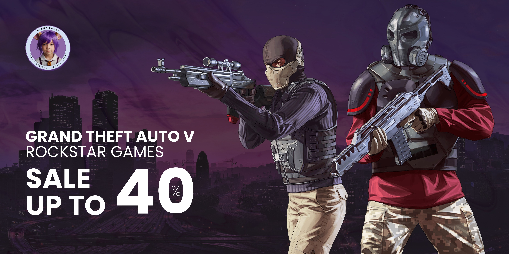

# berfinsfrgl.github.io
T.C EGE ÜNİVERSİTESİ TİRE KUTSAN MESLEK YÜKSEKOKULU 
2024 – 2025 GÜZ DÖNEMI 
BS.
WEB EDITÖRÜ FINAL PROJESI SUNUM RAPORU 

Giriş 

Bu raporda, Bunny Games adlı oyun bilgi platformu için geliştirilen web sitesi tasarımı ve işlevselliklerine dair detaylı bir değerlendirme sunulmuştur.  
Rapor; kullanılan HTML, CSS ve JavaScript kodlarını, işlevlerini, kullanıcı deneyimine etkilerini ve tasarıma yönelik özellikleri açıklamaktadır. Raporda oluşturulan projeyi hem teknik hem de akademik çerçevede incelemektir. 
Kullanılan Teknolojiler ve Yaklaşımlar 
Bu proje, modern web geliştirme standartlarına uygun olarak HTML, CSS ve JavaScript kullanılarak hazırlanmıştır. 

HTML:  
İçerik ve yapıyı belirlemek için temel oluşturulmuştur. 
Medya öğeleri (videolar, resimler) ve etkileşimli form elemanları düzgün bir şekilde entegre edilmiştir. 
Web sitesindeki sayfa yapısının doğru bir şekilde tanımlanması, arama motorları ve ekran okuyucular için erişilebilirliği artırarak, kullanıcıların web sitesine kolay erişimini sağlamaktadır. 

CSS:  
Tasarım ve görsel estetik sağlanmıştır.  
Renk temaları, düzen ve responsive (duyarlı) tasarım kuralları kullanılmıştır. 

JavaScript:  
Dinamik içerik yönetimi ve kullanıcı etkileşimlerini desteklemek için kullanılmıştır. 
Etkileşimli Slider 
Filtreleme Sistemi 
Modal Penceresi 
Dinamik İçerik Yükleme 
Görsel Açıklaması: Proje Dosyalama Yapısı 

Maddelere Göre İnceleme 

Listeler ve Linkler 
Liste: Anasayfa başlığında gezinmeyi kolaylaştıran bir liste navigasyonu bulunmaktadır:  
  <header> 
    
BUNNY GAMES
 
    <nav> 
      <ul> 
        <li><a href="index.html">Anasayfa</a></li> 
        <li><a href="bilgilendirme.html">Bilgilendirme</a></li> 
      </ul> 
    </nav> 
  </header> 
Linkler: Bu liste elemanları site içinde ilgili bölümlere yönlendirme yapar ve kullanıcı dostu bir yapı sağlar. 
Oyun Kategorileri: Sırasız listeler kullanılarak, kullanıcıların oyunları türlerine göre filtrelemeleri sağlanmıştır. 
Oyun Detayları: Sistem gereksinimleri gibi bilgiler, liste halinde düzenlenmiştir. 
Ana Menü: "Anasayfa" ve "Bilgilendirme" gibi bağlantılar, kullanıcıların temel sayfalara hızlıca erişmesini sağlar. 
Satın Alma Linkleri: Her oyun sayfasında bulunan "Satın Al" butonları, dış bağlantılara yönlendirir. 
Banner Bağlantıları: Resimler, kullanıcıları farklı oyun sayfalarına yönlendiren linkler olarak işlev görmektedir. 
 
Görüntüler 
Kullanılan Görüntüler: Logo görseli ve oyun görselleri kullanılmaktadır.  
    
 
         
    
 
Görsellerin Düzeltilmesi: Görseller, boyutlandırma ve sıkıştırma işlemlerinden geçirilmiştir. 
Oyun Kutucuklarının Tasarlanması: 
İnternet üzerinden bir adet siyah renkli, desenli bir background bulunmuştur. 
Her oyunun logosu PNG formatında indirilerek background üzerine yerleştirilmiştir. 
Hazır hale getirilen logolar, JPG çıktı alınarak “images/oyunlar” klasörüne yerleştirilmiştir. 
Açıklama: Banner, öne çıkan oyunlar header kısmında kullanılmıştır. Oyun görselleri ise grid tasarımında listeleme için kullanılmıştır. 

Banner Tasarımı: 
Oyun içinden bir sahne background olarak belirlenmiştir. Belirlenen background uygun renkle karartılmıştır. 
Oyunun logosu PNG formatında indirilerek background üzerine eklenmiştir. 
Oyundaki karakter(-ler) background üzerine eklenmiştir. 
Son olarak Bunny Games logosu eklenerek bannerlar tamamlanır. 

 

CSS Stilleri 
Harici ve Dahili Stiller: Hem harici bir CSS dosyası hem de satır içi CSS tanımlamaları kullanılmıştır. 

Seçiciler:  
.game-grid: Oyunların listelendiği grid tasarımını yönetir.  
.game-grid { 
  display: grid; 
  grid-template-columns: repeat(5, 1fr); 
  gap: 20px; 
} 

@media kuralı ile responsive tasarım sağlanmıştır:  
@media screen and (max-width: 768px) { 
  .game-grid { 
    grid-template-columns: repeat(2, 1fr); 
  } 
}  
Açıklama: CSS ile tasarım, kullanıcı deneyimini artıracak şekilde görselleştirilmiştir. 

 

HTML Tablosu 
Tablo: Footer’da sayfasında kullanılan örnek bir tablo:  
  <footer> 
    <table> 
      <tr> 
        <td>© 2024 Tüm Hakları Saklıdır. <a href="https://www.bunnygames.com">Bunny Games</a></td> 
      </tr> 
    </table> 
  </footer>   
Açıklama: Kullanıcının oyun bilgilerini öğrenmesi sırasında oyun detaylarını görmesi amacıyla tablolar kullanılmaktadır. 

CSS3 
Özellik: "transition" ile geçiş animasyonu:  
button { 
  transition: background-color 0.3s ease; 
} 
Açıklama: Hover efektlerinde kullanıcıya görsel geri bildirim sağlanmaktadır. 

Etkileşimli Özellikler 
Slayt Geçişi: setInterval(nextSlide, 5000); (5 saniyede bir geçiş için kullanılır.) 
Modal Pencere: Dinamik içerik ile oyun detayları:  
function openModal(title, videoUrl, description, buyUrl) { 
  document.getElementById("modalTitle").textContent = title; 
  document.getElementById("modalVideo").src = videoUrl; 
  document.getElementById("modalDescription").textContent = description; 
  document.getElementById("buyLink").href = buyUrl; 
  document.getElementById("gameModal").style.display = "flex"; 
} 
Açıklama: Kullanıcılara etkileşimli bir deneyim sunmak için hazırlanmıştır. 

Multimedya Kullanımı 
Kullanım: Oyun videoları, modal pencereler içinde gösterilmektedir.  
<iframe id="modalVideo" src="" frameborder="0" allowfullscreen></iframe> 
Açıklama: Kullanıcıların oyun içeriği hakkında bilgi edinmesi amacıyla kullanılmaktadır. 

Duyarlı Tasarım 
Media Query:  
@media screen and (max-width: 768px) { 
  .game-grid { 
    grid-template-columns: repeat(2, 1fr); 
  } 
} 
Açıklama: Her cihazda optimal görüntüleme sağlanmıştır. Sitenin modern tarayıcılarda test edilmesi tamamlanmıştır. 

Sonuç ve Değerlendirme 
Bu projeyi geliştirirken, modern web geliştirme standartlarına uygun teknikler ve araçlar kullandım. Dinamik içerik yönetimi, duyarlı tasarım ve kullanıcı dostu özellikler ile estetik bir oyun bilgi platformu oluşturmayı hedefledim ve bunu başarıyla gerçekleştirdim. Kullandığım yöntemler ve yazdığım kodlar, kullanıcı deneyimini iyileştirmeye, etkileşimi artırmaya ve profesyonel bir çözüm sunmaya odaklanmıştır. Proje süresince öğrendiğim yeni tekniklerle hem kişisel gelişimime katkıda bulundum hem de bu web sitesiyle etkili bir sonuç ortaya koydum. 
